<h1 align="center">Hi there, I'm Anurag 👋</h1>

  <picture>
    <source media="(prefers-color-scheme: dark)" srcset="dark_mode.svg">
    <source media="(prefers-color-scheme: light)" srcset="light_mode.svg">
    
  </picture>

# GitHub Stats:
 
 

## 🐍 Contribution : 
<picture>
  <source media="(prefers-color-scheme: dark)" srcset="https://raw.githubusercontent.com/anuragsGit24/anuragsGit24/output/github-snake-dark.svg" />
  <source media="(prefers-color-scheme: light)" srcset="https://raw.githubusercontent.com/anuragsGit24/anuragsGit24/output/github-snake.svg" />
  
</picture>

